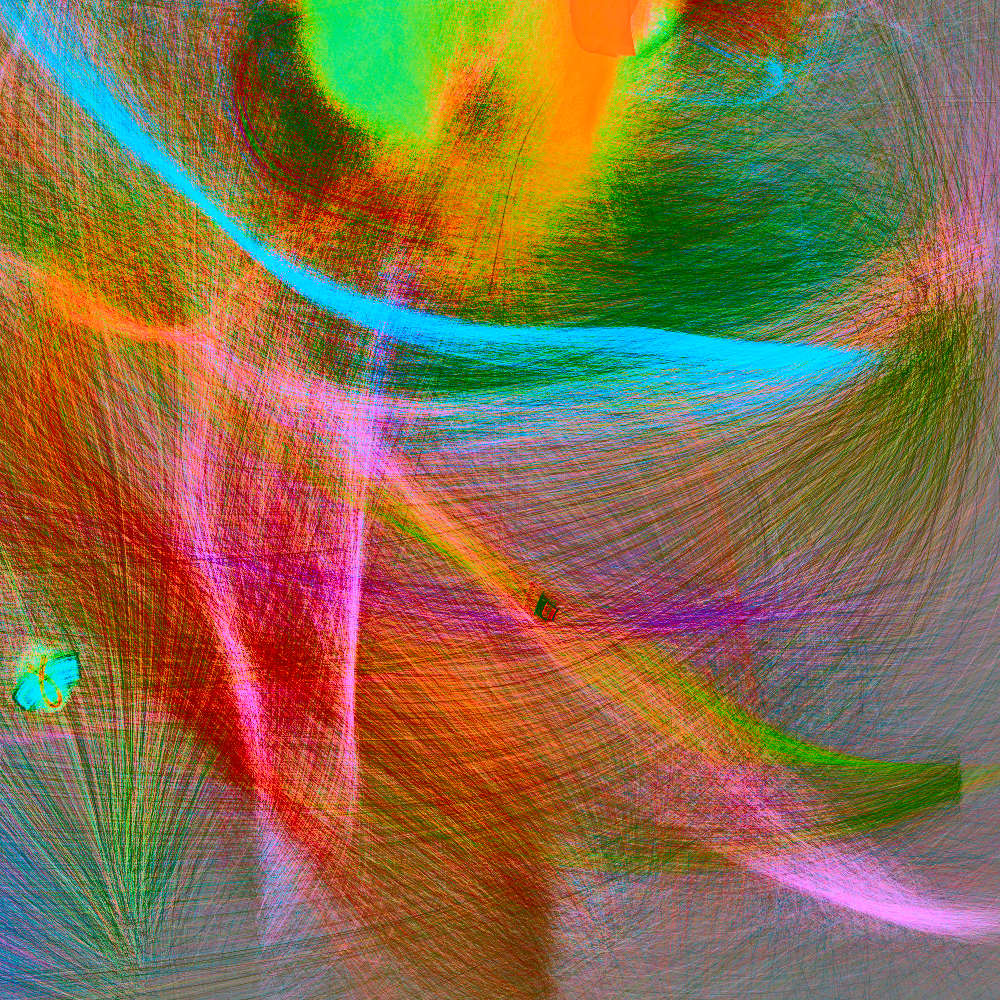

# streams

More programmatically generated art:



Paraameters for the above instance:
```
[src/main.rs:340] &params = Params {
    size: 1000,
    seed: 0,
    num_forces: 200,
    force_strength_dist: LogNormal {
        norm: Normal {
            mean: 2.302585092994046,
            std_dev: 0.6931471805599453,
        },
    },
    force_spread_dist: LogNormal {
        norm: Normal {
            mean: 5.298317366548036,
            std_dev: 0.6931471805599453,
        },
    },
    num_faucets: 40,
    faucet_color_center_dist: Normal {
        mean: 0.0,
        std_dev: 0.03,
    },
    faucet_color_spread_dist: Exp {
        lambda_inverse: 0.03,
    },
    faucet_position_spread_dist: Exp {
        lambda_inverse: 80.0,
    },
    faucet_velocity_spread_dist: Exp {
        lambda_inverse: 1.0,
    },
    num_streams: 100000,
    decay_dist: Exp {
        lambda_inverse: 0.001,
    },
    max_decay_factor: 10.0,
    velocity_cap: 40.0,
    color_cap: 2.0,
}
```
